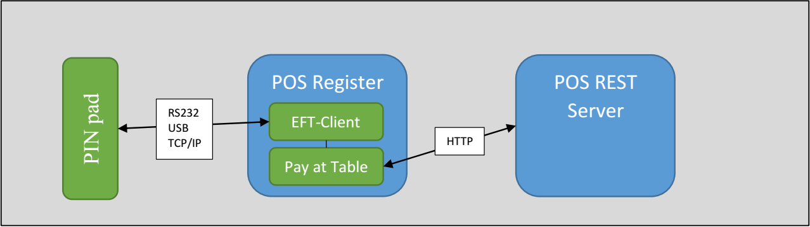

# Linkly.PayAtTable

The Pay at Table API provides a common interface for the PIN pad to utilise the EFT-Client to retrieve available tables and orders so payment functions (e.g. tender, customer receipt etc.) can be performed by an operator on the PIN pad without using the main POS UI. 

The Pay at Table client requires the POS to act a data source so that it can retrieve information about available tables, orders, payment options etc. 

The Pay at Table client supports two data source options for the POS; a REST server or directly through the existing Linkly interface. 

## Start Developing

To start developing the Linkly Pay at Table solution, following the instructions on the [Linkly API](http://linkly.com.au/apidoc/TCPIP/#pay-at-table).

## REST Server 
When in REST server mode the Pay at Table extension will connect directly to the POS REST Server. 

An example REST server can be found in the [PayAtTable.Server](PayAtTable.Server) folder.

## Build and Test

1. Run Visual Studio 2017 as Administrator and open the PayAtTable.Server solution.
2. Make sure PayAtTable.Server is the start-up project, run it in IISExpress. The browser should show the result of the api/settings GET request.
 
### SSL
1. In the PayAtTable.Server Project Properties>Build>Conditional Compilation symbols, set the value to "SSL" to require https.
2. In the Web tab, set the project URL port to a value between 44300-44399 for IISExpress to enable SSL (https://docs.microsoft.com/en-us/iis/extensions/using-iis-express/running-iis-express-without-administrative-privileges#using-ssl).
eg. https://localhost:44302

3. Also in the Web tab, set the Start URL to [projectURL]/api/settings for quick testing.
eg. https://localhost:44302/api/settings

4. You can modify the settings in Web.config as described in the next section for different validations.

#### Web.Config Configuration

The following settings can be configured from Web.config related to PayAtTable SSL setup:

| Field      | Description |
|--------------|--------|
| `ValidateClientCert` | If 1, the POS server will validate incoming client certificates from each request. `ClientCACertFilePath` must be set. |
| `ClientCACertFilePath` | The certificate file to validate client certificates against. |
| `ValidateClientCert` | If 1, the POS server will validate incoming requests against the given `ClientAuthHeader` value. `ClientAuthHeader` must be set. |
| `ClientAuthHeader` | The Authorization header value required for incoming requests. |

*Note: In order to receive client certificates, you must deploy the PayAtTable.Server in IIS and enable the Accept Certificates feature in its SSL settings.*

## Release Notes
v1.0.2.0
- Change response code to 201 for CreateTender.

v1.0.1.0
- Remove deprecated fields; add more sample data.

v1.0.0.0
- Initial release.